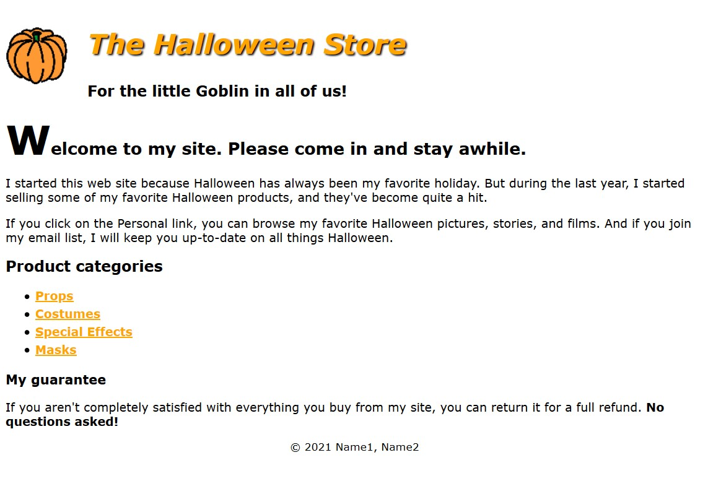

# Halloween Project - Chapter 4 

## Directions

### Partner 1
- In the html footer, add both partners names.
- Create a new folder called "styles". Inside that folder create an external style sheet called "main.css".
- Create a `<link>` tag as a child of the `<head>` section in the html file. Link it to the new css file.
- [https://necolas.github.io/normalize.css/](Download the normalize.css file). Place it in your "styles" folder. Create a new `<link>` tag before the other that links to this new css file.
- In "Chapter 3, Part 1, How to code text elements", you learned about Google Fonts. Go to [https://fonts.google.com](https://fonts.google.com). Select a sans-serif font for body text. Select a display or handwriting font for headings.
- Copy the `<link>` tags and paste them above the other `<link>` tag in your HTML, or copy and paste the `@import` statements in your CSS.
- In the CSS file:
  - Create a `*` wildcard selector. Set `box-sizing` to `border-box`. Set `max-width` to `100%`.
  - Create an `html` selector. Set `font-size` to a value in `px`.
  - Create a `body` selector. Set `font-family` to the sans-serif font you selected.
  - Create a `header` selector. Set `font-size` to a value in `em`.
  - Create a `main` selector. Set `font-size` to a value in `em`.
  - Create a `footer` selector. Set `font-size` to a value in `em`. Reduce the font size slightly.
  - Create a `footer p` selector. Set `text-align` to center align the copyright information.
  - Create a `header h2` selector. Set `font-family` to the display or handwriting font you selected. Set `font-size` to a value in `rem`.
  - Create a `header h3` selector. Set `font-size` to a value in `rem`.
  - Create a `main h1` selector. Set `font-size` to a value in `rem`.
  - Create a `main h2` selector. Set `font-size` to a value in `rem`.
  - Create a `main h3` selector. Set `font-size` to a value in `rem`.

### Partner 2
- In the CSS file:
  - Create a `main h1:first-letter` selector. Set `font-size` to a value in `rem` to format the first letter of the first heading in the main content so it's larger than the other letters in the heading.
  - Create a `header img` selector. Set `float` to `left` so the image floats to the left and indent both headings. 
  - Create a `header:after` selector. [https://css-tricks.com/snippets/css/clear-fix/](Add a clearfix) because the header is the parent element of the image you just floated.
  - Use the `header h2` selector to change the color of the first heading to orange (using hexadecimal), and italicize it.
  - Use the `header h2` to either and add a black shadow or a Google font effect as described in "Chapter 3, Part 1, How to code text elements".
  - Create a `header h2, header h3` selector to either set `margin-left` or `text-indent` to 25px to add a little separation between the pumpkin image and the header text.
  - Create a `main a` selector to format the links so they're displayed in boldfaced orange text (using rgb). 
  - Create a `main a:hover, main a:focus` selector to format the link focus and mouse hover to display with green text (using hsl).
  - Create a `main ul` selector and set a `line-height` property to format the list to increase the space between the list items.
- Run the code through the [HTML validator](https://validator.w3.org/). Fix any errors or warnings. 
- Send a link of the live website for grading.
  - The link will look like this:  

## Goal

